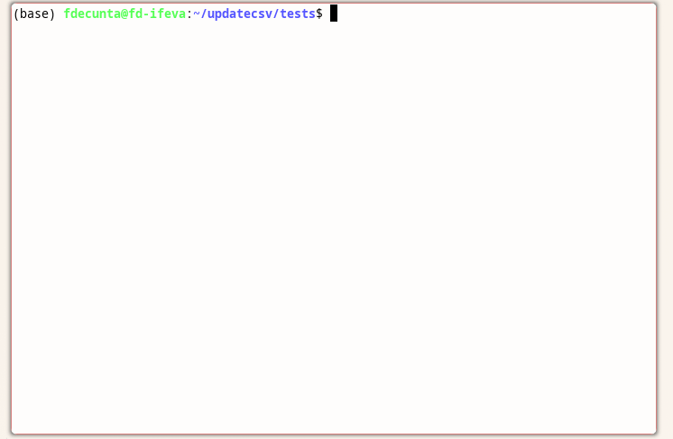

# updatecsv

Command-line tool for transferring data from one CSV file to another. This is done based on a unique identifiers column (e.g., ID numbers). 

It is intended for updating data from experiments, where each row represents an experimental unit and each column a variable. Thus, the program it is like a merge, but with a few constraints:

- It does not add new rows.
- The identifiers in the input file must be a subset of those in the original file.
- Data in the original file cannot be overwritten.

The program creates a backup file, updates the original file, and prints the changes in the terminal.



## Why?

I work with many plants, each identified by a unique ID. During and after experiments, I measure various attributes for these plants, but the new data is rarely ordered by ID. Manually entering values into a spreadsheet—jumping from plant ID 4 to 132, then 54, and so on—is both time-consuming and prone to errors.

## Usage 

```
updatecsv [OPTIONS] original_data.csv input_data.csv

Options:
  -s   [separator]    Specify the item separator in the csv files (default is comma)
  -d                  Dry-run with no changes made
  --by [column name]  Defines the column to use for the merge (default is id)
```

## Examples

Adding new data with default values (comma as separator, id as merge column):

```bash
updatecsv experiment_2023.csv aboveground_biomass.csv
```

Adding new data with custom options (semicolon as the separator, dry-run mode, and a custom merge column named 'key'):


```bash
updatecsv -s ';' -d --by key experiment_2022.csv alkaloids.csv
```


## Installation

```shell
git clone https://github.com/fdecunta/updatecsv.git
cd updatecsv
sudo make install
```

To remove the program:

```shell
cd updatecsv
sudo make uninstall
```

## Requirements

- Python 3.6+
- CSV library

